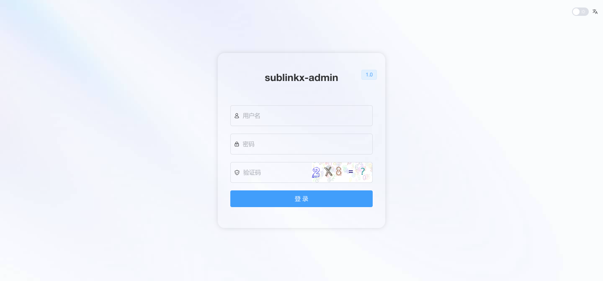
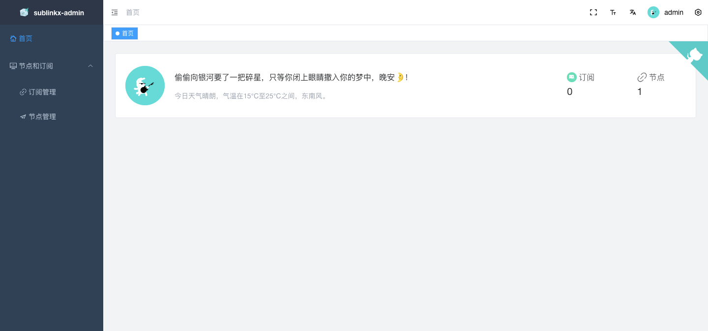

<div align="center">
  
  <h1>SubLinkX</h1>
  <p><strong>Proxy subscription management, routing diagnostics, node quality analytics, and safe publishing.</strong></p>
  <p>SubLinkX does more than generate subscriptions: it explains how traffic will route, verifies whether nodes really work, checks client compatibility, and decides whether a configuration is safe to publish.</p>
</div>

<div align="center">
  
  
  
  
  
  
  <br />
  <a href="README.md">中文</a> · English
</div>

---

## What SubLinkX Is

SubLinkX is built for self-hosted proxy nodes, airport subscriptions, and complex Clash/Mihomo routing templates. Its goal is to turn a traditional subscription converter into a configuration validation, debugging, publishing, and rollback platform.

Typical workflow:

```text
Subscriptions / Nodes
    ↓
Templates & Rules
    ↓
Syntax / Reference / Cycle / Protocol Validation
    ↓
Routing Simulation for Important Targets
    ↓
Target-aware Node Selection
    ↓
Real Egress Verification
    ↓
Compare with Last Known Good
    ↓
Safe Publish / Keep Previous Version on Failure
```

Backend: **Go + Gin + GORM + SQLite**. Real node checks are powered by **sing-box**. Frontend: **Vue 3 + Element Plus + ECharts + Monaco Editor**.

## Major Features

### Safe Publish

Select a subscription, template, and target client. SubLinkX builds a candidate configuration first and validates it before changing the live binding:

- syntax and structure validation
- proxy-group, node, rule, and provider reference checks
- cycle detection
- Rule Provider download / parse / cache validation
- target-client protocol compatibility checks
- saved routing regression cases
- node availability and real egress tests
- Last Known Good comparison
- transactional publish only after all blocking checks pass

Failures keep the previous template binding and LKG intact.

### Routing Explainer

Given a domain, IP, port, and TCP/UDP context, SubLinkX explains the first-match routing path:

```text
gemini.google.com
  → RULE-SET Google
  → Gemini policy group
  → JP auto-selection group
  → JP-02
  → actual Japan egress
```

It also shows preceding rule misses, Rule Provider sources, policy-group chains, candidate/excluded nodes, target-aware node selection, and before/after template routing diffs.

Persistent routing regression cases can define expected policies, forbidden policies, expected regions, ports, and protocols.

### Node × Target Quality Matrix

SubLinkX records quality as:

```text
Node × Target × Scene × Success/Failure × RTT
```

Scenes include network, AI, social, content, finance, tools, development, and media. Routing chooses nodes using:

```text
exact-target history
  → same-scene history
  → general TCP quality fallback
```

Low-load scene sampling runs periodically for currently online nodes, while full target sampling can be started manually from the task center.

### Client Compatibility Matrix

Preflight diagnostics cover:

- Clash / Mihomo
- sing-box
- Surge
- Loon
- Quantumult X

Results distinguish native support, conversion requirements, unsupported combinations, and fields that may be lost. Checks include `ws`, `grpc`, `httpupgrade`, `reality`, UDP, TFO, MPTCP, and related transport capabilities.

### Rule Center & Update Impact Preview

- local and remote Clash Rule Providers
- local provider path confinement under `template/`
- remote cache fallback and request timeouts
- `domain`, `ipcidr`, and `classical` behaviors
- added / removed / changed / duplicated / shadowed rule analysis
- template reference discovery
- before/after routing impact for configured targets
- cache snapshots and one-click rollback

### Persistent Task Center

Tracks node / egress tests, quality-matrix sampling, template routing validation, airport sync, rule sync, subscription builds, template validation, safe publish, and system deployment tasks.

Tasks expose progress, duration, errors, cancellation, retry, and history. Interrupted tasks remain visible after a service restart.

### Immutable Subscription Artifacts & Last Known Good

Background builds create immutable artifacts containing input/template/rule checksums, artifact SHA, validation reports, routing checks, and timestamps.

Validated artifacts can become **Last Known Good**. If live generation or an external source fails, SubLinkX can fall back to a previously verified artifact.

### Configurable Egress Targets

Admins can configure target name, key, domain, category, icon, GET/HEAD method, path, expected status codes, response markers, egress-IP requirement, timeout, retry, enabled state, and ordering.

Expected countries are never hardcoded into targets; region expectations are inferred from the active template and policy constraints.

### Node & Group Management

- every node must belong to at least one group
- historical ungrouped nodes are assigned to a default group
- nodes may belong to multiple groups
- airport sync maintains its corresponding group automatically
- individual nodes or entire groups can be globally hidden without deleting data
- hidden nodes are excluded from normal lists, subscription output, quality sampling, recommendations, routing selection, and safe publishing

### Security, Audit & Public Status

- bcrypt passwords with automatic legacy plaintext migration after successful login
- login rate limiting
- hashed API Tokens with `read`, `write`, `admin` scopes and expiration
- admin-only protection for high-risk publishing, deployment, restore, and audit operations
- sensitive logging redaction
- explicit trusted-proxy configuration through `SUBLINKX_TRUSTED_PROXIES`
- audit logs without request bodies or credentials
- sanitized configuration export
- public `/status` page with aggregate availability and incident timeline, without exposing node addresses or secrets

## Subscription Outputs

Current generated outputs include:

- Clash / Mihomo
- Surge
- Loon
- V2Ray / Base64 universal node subscription

Compatibility diagnostics cover more clients than the generated-output list, allowing SubLinkX to warn about whether the same nodes can be represented safely in sing-box or Quantumult X.

## Node Testing Philosophy

SubLinkX does not treat “TCP port reachable” as “node usable”. It tracks separate dimensions including TCP reachability, 24h/7d/30d availability, average/P95 latency, jitter, consecutive failures, unlock observations, target-specific proxy requests, and real egress information when available.

## Preview




> Some screenshots may lag behind the latest UI. The running version is authoritative.

## Linux Installation

### One-command source build

SubLinkX is built with `with_utls` and `with_quic` for Reality, Hysteria2, TUIC, and related capabilities.

```bash
curl -s -H "Cache-Control: no-cache" -H "Pragma: no-cache" \
  https://raw.githubusercontent.com/Xioaruan912/SubL/main/install.sh | sudo bash
```

Requirements:

- `git`
- Go 1.25+
- Node.js 20+
- corepack / pnpm
- `curl`

The installer builds the frontend, compiles Go, registers systemd, and installs the management command. The compatibility command / binary name is currently:

```bash
ppeelink
```

Default web port: `8000`.

Initial administrator credentials:

```text
Username: admin
Password: 123456
```

**Change the default password immediately after the first login.**

### Docker

```bash
docker build -t sublinkx .

docker run --name sublinkx \
  -p 8000:8000 \
  -v $PWD/db:/app/db \
  -v $PWD/template:/app/template \
  -v $PWD/logs:/app/logs \
  -d sublinkx
```

Back up at least `db/` and `template/` before upgrades.

## Development & Build

```bash
cd webs
corepack enable
pnpm install --frozen-lockfile
pnpm exec vue-tsc --noEmit
pnpm build
cd ..

go test ./...

GOOS=linux GOARCH=amd64 \
  go build -tags "with_utls with_quic" -ldflags="-w -s" -o ppeelink .
```

`build.sh` can also build Linux amd64 / arm64 artifacts.

## Repository Layout

```text
api/          HTTP APIs, routing explanation, safe publishing, task center
models/       SQLite / GORM models, quality, tasks, artifacts
node/         Node parsing, sing-box checks, egress and protocol capabilities
routers/      Gin route registration
rulecenter/   Rule parsing, provider cache, rule-center services
template/     Clash / Surge / Loon templates and local rules
webs/         Vue 3 management frontend
db/           Runtime SQLite/config/cache data
```

## Upgrade Notes

- `db/` contains application data; do not treat it as disposable cache.
- Back up `db/`, `template/`, and the running binary before upgrades.
- For production, prefer: backup → temporary upload → SHA256 verification → atomic replacement → restart → HTTP/log verification.
- Never commit passwords, API Tokens, airport URLs, or node links to a public repository.

## License

[MIT](LICENSE)

## Acknowledgements

Thanks to [gooaclok819/sublinkX](https://github.com/gooaclok819/sublinkX) for the early project foundation and ideas. SubLinkX has since been continuously expanded and reworked around node-quality analytics, routing explanation, Rule Providers, persistent tasks, artifact rollback, safe publishing, security auditing, and operations.
